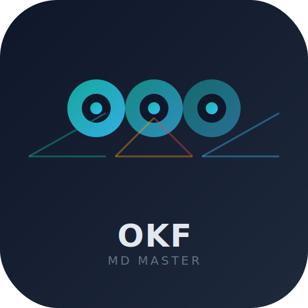

<div align="center">
  
  <h1>OKF MD Master</h1>
  <p><strong>Turn any text into structured, AI-ready knowledge — automatically.</strong></p>

  [](https://github.com/ThaiJenspacito/OKF_MD_Master/stargazers)
  [](https://github.com/ThaiJenspacito/OKF_MD_Master/network)
  [](LICENSE)
  [](https://thai-jenspacito-okf-md-299034318175.europe-west1.run.app)
  [](https://github.com/ThaiJenspacito/OKF_MD_Master/pulls)
  [](#-pricing)
  [](https://github.com/marketplace)

  <br>
  <a href="https://github.com/anomalyco/opencode" title="Built entirely with OpenCode">
    
  </a>

  **Connect:**
  [](https://linkedin.com)
  [](https://www.facebook.com/profile.php?id=61592172550155)
  [](https://wa.me/4915123445864)
  [](https://t.me/JensBeckerBot)
  [](#)

  <hr width="50%">
</div>

## 🚀 Why OKF? The Problem We Solve

> **Markdown files are everywhere — but AI agents can't read them effectively.**

Your Obsidian vault, Notion pages, project docs, and code READMEs contain immense knowledge. But without structured metadata, AI tools can't parse, index, or use them. You're sitting on a goldmine your agents can't access.

**OKF MD Master bridges this gap.** It watches your folders, intercepts new files, enriches them with YAML frontmatter via AI, and produces **Open Knowledge Format** artifacts ready for any LLM agent, RAG system, or Google AI Studio.

---

## ✨ What Makes This Different

| Traditional MD Files | With OKF MD Master |
|---|---|
| Unstructured text | Rich YAML frontmatter (name, type, tags, version) |
| Not machine-readable | Ready for AI agents, RAG, fine-tuning |
| Manual categorization | AI-powered auto-tagging |
| Lost in folders | Indexed with search, filter, download counters |
| Single-user | Multi-user with GitHub OAuth |
| Local only | P2P sync via GitHub — share computing power |

---

## 🏗️ Architecture

```
┌──────────────┐     ┌──────────┐     ┌───────────┐     ┌──────────────┐
│  .md files   │ ──▶ │  Scout   │ ──▶ │ Architect │ ──▶ │  OKF Skills  │
│  (your docs) │     │  Agent   │     │  (LLM)    │     │  (YAML+MD)   │
└──────────────┘     └──────────┘     └───────────┘     └──────────────┘
                           │                 │                  │
                           ▼                 ▼                  ▼
                     data/originals   data/okf_ready      data/processed
                     data/scouted     data/lessons-learned data/index.md
```

**7 Autonomous Agents working together:**
- 👁️ **Watcher** — Monitors directories for new .md files
- 🔎 **Auto-Scanner** — Searches your laptop every 5 minutes
- 🕵️ **Scout** — Copies & validates files, zero data loss
- 🤖 **Architect** — Transforms via LLM (DeepSeek, Gemini, Cohere)
- ⏱️ **Scheduler** — Idle-aware processing, CPU-friendly
- 🐙 **GitHub Bot** — Auto-responds to issues with OKF knowledge
- 📱 **PWA** — Installable on Android, iOS, Windows, macOS

---

## 🎯 Key Benefits

### 🔄 Zero Data Loss
Every source file is preserved in 4 copies: `originals/`, `scouted/`, `okf_ready/`, `processed/`. Nothing is ever deleted. Failed transformations go to `lessons-learned/` — learn from every attempt.

### 🧠 AI-Ready Output
All skills get rich YAML frontmatter:
```yaml
name: Smart Home Architecture
description: MQTT-based IoT system with Node-RED and Grafana
type: skill
version: 1.0.0
tags: [MQTT, IoT, Home-Automation, Node-RED]
```

### 💤 CPU-Friendly
Only processes when your computer is idle (>2 min no input, CPU <30%). Never interrupts your work.

### 🌐 P2P Knowledge Network
Connect to any GitHub repo. Share skills across machines. More computing power = more download credits. Your hardware earns you access.

### 💰 Contribution Economy
Earn credits by processing files with your LLM. Spend credits to download skills. Leaderboard tracks top contributors. **Power = Access.**

### 🔗 Multi-Source Ingestion
- **Local files**: Drop .md anywhere, auto-detected
- **GitHub repos**: Paste any repo URL → README fetched
- **Web pages**: Any URL → HTML converted to MD
- **HuggingFace models**: `microsoft/phi-2` → docs downloaded
- **Laptop scan**: Auto-discovers .md files on your computer

---

## 🚀 Quick Start

```bash
git clone https://github.com/ThaiJenspacito/OKF_MD_Master.git
cd OKF_MD_Master
npm install
cp .env.example .env   # add your API keys
npm start
```

Open `http://localhost:5000` — click **Continue without password** (dev mode).

**Or use our Cloud instance** (always up-to-date):  
👉 [thai-jenspacito-okf-md-299034318175.europe-west1.run.app](https://thai-jenspacito-okf-md-299034318175.europe-west1.run.app)

---

## 📦 Tech Stack

| Layer | Technology |
|-------|-----------|
| Runtime | Node.js 22+ |
| LLM Providers | DeepSeek, Gemini (Google Cloud), OpenRouter (Cohere) |
| Frontend | Vanilla HTML/CSS/JS (zero CDN) |
| Storage | Local filesystem + GitHub Sync |
| Deployment | Docker + Google Cloud Run |
| Auth | PIN + Google OAuth + GitHub OAuth |
| PWA | Service Worker + Manifest |

---

## 🌟 Star This Repo!

Every star helps grow the OKF ecosystem. More stars → more contributors → more computing power → **everyone benefits**.

**[⭐ Star on GitHub](https://github.com/ThaiJenspacito/OKF_MD_Master)**

---

## 🤝 Community

We're building the future of AI knowledge infrastructure — and you can be part of it:

- **Contribute code**: Pick an issue, submit a PR
- **Share computing power**: Run a node, earn credits
- **Add skills**: Push your OKF skills to the shared library
- **Spread the word**: Star the repo, share with your network
- **Give feedback**: Open an issue — our GitHub Bot responds automatically!

[](https://github.com/ThaiJenspacito/OKF_MD_Master/issues)
[](https://github.com/ThaiJenspacito/OKF_MD_Master/graphs/contributors)

---

---

## 🔗 Ecosystem & Integrations

OKF MD Master works alongside the best tools in the AI ecosystem. Our skills serve as structured context for any LLM pipeline:

| Project | Integration | How OKF Helps |
|---------|------------|---------------|
| [LangChain](https://github.com/langchain-ai/langchain) | Use OKF skills as Document loaders | Structured metadata for better retrieval |
| [CrewAI](https://github.com/crewAIInc/crewAI) | Load OKF skills as Agent tools | Multi-agent knowledge sharing |
| [AnythingLLM](https://github.com/Mintplex-Labs/anything-llm) | Import OKF vault directly | Pre-tagged, AI-ready documents |
| [PrivateGPT](https://github.com/zylon-ai/private-gpt) | Ingest OKF skills folder | Local RAG with structured context |
| [Continue.dev](https://github.com/continuedev/continue) | Use OKF as custom context provider | IDE-integrated AI with your knowledge |
| [n8n](https://github.com/n8n-io/n8n) | Webhook to OKF pipeline | Automated workflow → structured knowledge |

**Are we missing your project?** [Open an issue](https://github.com/ThaiJenspacito/OKF_MD_Master/issues) — we'll add it.

---

## 💎 Pricing

| Tier | Price | Features |
|------|-------|----------|
| **Free** | $0 | Up to 100 users. Unlimited skills. All features. |
| **Pro** | Coming soon | Bulk import/export. Priority queue. Custom models. |
| **Enterprise** | Contact us | On-premise. SLA. Dedicated instance. |

**We're free for the first 100 users.** Join now, shape the future.

---

---

## 👤 About the Creator

**20+ years of entrepreneurial leadership** across IT, logistics, retail, and hospitality — now building the infrastructure for agentic AI knowledge.

**Background:**
- Business Administration (Bachelor)
- Founder & CEO of multiple companies (2002–2023)
- International trade: Export Manager in Beijing & Shenzhen
- Franchise development & multi-location operations
- 5 retail locations, 4,000 m² logistics center with SAP B1

**Tech:**
- LLM, GPT, HTML, CSS, Canvas
- Windows & macOS, SAP B1, MS Office
- Self-taught full-stack developer

**Languages:** German (native) · English (professional)

---

## 📫 Contact

- **GitHub**: [@ThaiJenspacito](https://github.com/ThaiJenspacito)
- **Issues**: [github.com/ThaiJenspacito/OKF_MD_Master/issues](https://github.com/ThaiJenspacito/OKF_MD_Master/issues)
- **Cloud**: [thai-jenspacito-okf-md-299034318175.europe-west1.run.app](https://thai-jenspacito-okf-md-299034318175.europe-west1.run.app)

---

<div align="center">
  <sub>Built with ❤️ by the OKF community · <a href="https://github.com/ThaiJenspacito/OKF_MD_Master">Star us on GitHub</a></sub>
</div>
